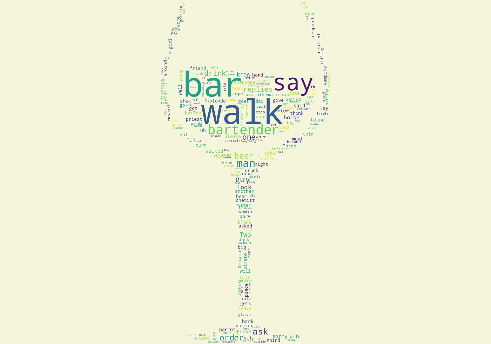

# Walks Into A Bar Dataset

This dataset contains 1498 bar jokes webscraped from various sources on the internet.

The sources used are listed below.

|   **Name**    | **URL** |
|:--------------|:-------:|
| `grammarbook`     | https://www.grammarbook.com/blog/definitions/walks-into-a-bar/ |
| `thrillist`       | https://www.thrillist.com/culture/best-walks-into-a-bar-jokes  |
| `jokojokes`       | https://jokojokes.com/walks-into-a-bar-jokes.html              |
| `gamertelligence` | https://www.gamertelligence.com/walks-into-a-bar-jokes/        |

## Files

* The main dataset can be found in `jokes.csv` under `data/` directory.
* The primary notebook used for scrapping the aforementioned websites is `notebooks/walks_into_bar_scrapper.ipynb`.
* `notebooks/seleniumconfig.py` is a helper module for obtaining a chrome `WebDriver` with predefined configurations.
* **Note** - Running the scrapper notebook requires installing all the packages in `requirements.txt`. Additionally, a chromedriver executable suitable for your operating system needs to be present in the root directory.

## Disclaimer

Please note that the data has been webscrapped with minimal editing of the original text.
Therefore some jokes might be repeated, or might be NSFW. Certain websites had user-provided jokes, which as a result might not conform to the general structure of a walks-into-a-bar joke.

Feel free to contribute to this dataset if you can come across further sources for bar jokes.

## Further Links

